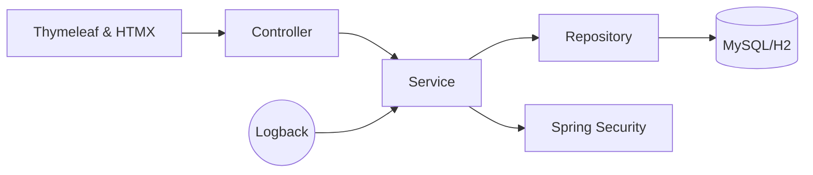

# Book Management 📚

## 1. Descriere pe scurt

Book Management este o aplicație web completă care le permite cititorilor să își organizeze colecția de cărți, să descopere lecturi noi și să împărtășească recenzii. Platforma îmbină un backend robust (Spring Boot) cu interfețe server‑side (Thymeleaf), adresând atât nevoile administrative, cât și cele sociale ale utilizatorilor pasionați de lectură.

## 2. Motivație & scop

**Problema** – Gestionarea colecțiilor de carte și schimbul de recomandări se face ad‑hoc pe multiple platforme neintegrate.  
**Scop** – Oferirea unui spațiu unde utilizatorii își pot administra, evalua și recomanda cărți.

## 3. Obiective

- CRUD pentru cărți, autori, categorii, recenzii și utilizatori.
- Autentificare securizată și profiluri multiple de execuție (dev și test).
- Performanță ridicată prin paginare, sortare și caching selectiv.
- Testare unitară și integrată
  
## 4. Funcționalități cheie

✅ CRUD entități principale (Carte, Autor, Categorie, Recenzie, Utilizator, Rol)  
✅ Relații JPA: @OneToOne, @OneToMany, @ManyToOne, @ManyToMany  
✅ Autentificare & autorizare cu Spring Security (JDBC)  
✅ Rating + comentarii pe carte  
✅ Căutare full‑text & filtrare avansată  
✅ Paginare & sortare rezultate  
✅ Profiluri dedicate (H2 pentru testare, MySQL pentru dev/prod)  
✅ Logging (SLF4J/Logback) și monitorizare (Spring Actuator)  

## 5. Demo & capturi de ecran

**Live demo:** https://bookmanagement.onrender.com

- **Adăugare carte**  


- **Listă lectură**  
    <!-- Adaugă poza aici -->

- **Recenzie carte**  
    <!-- Adaugă poza aici -->
  
  ### Pagina Principală
 ` http://localhost:8080/books/`
După logare, userul este redirecționat către pagina de cărți. Această pagina poate fi accesată chiar dacă userul este logat sau nu.

Pagina dacă userul este logat:


Pagina dacă userul nu este logat:


  ### 🔹 1. Adăugare carte

1. Navighează la `http://localhost:8080/books/add`
2. Completează formularul cu:
   - Titlu
   - ISBN (13 cifre)
   - Autor
   - Descriere
3. Apasă pe **"Submit"**.
4. Vei fi redirecționat către pagina `/books` unde cartea nou adăugată va fi vizibilă.


---

### 🔹 4. Vizualizare listă autori
Această pagină poate fi vizualizată doar de admini.

1. Accesează `http://localhost:8080/authors?=success`
2. Se va afișa o listă paginată de autori existenți.
3. Pagina include butoane pentru editare și ștergere.

📸 Captură recomandată: `docs/screenshot_authors_list.png`

---

### 🔹 5. Adăugare recenzie

1. Navighează la `http://localhost:8080/reviews/add/{idCarte}` unde `{idCarte}` este ID-ul unei cărți.
2. Completează:
   - Rating (1–5 stele)
   - Comentariu
3. Apasă **"Submit"**.
4. Recenzia apare în `/reviews/book/{idCarte}`.

📸 Captură recomandată: `docs/screenshot_add_review.png`

---

### 🔹 6. Funcții suplimentare

- Paginarea este disponibilă în `/books` și `/authors`
- Sortarea după titlu, autor, rating poate fi adăugată prin URL sau butoane suplimentare
- Utilizatorii trebuie să fie autentificați pentru a adăuga sau edita date

---


## 6. Arhitectură & tehnologii



| Layer      | Tehnologii |
|------------|------------|
| Backend    | Java 17 · Spring Boot 3.4 · Spring Data JPA · Hibernate |
| Frontend   | Thymeleaf · Bootstrap 5 · HTMX |
| Database   | MySQL 8 / MariaDB (prod) · H2 (test) |
| Testing    | JUnit 5 · Mockito · TestContainers · Spring Test |
| CI/CD      | GitHub   |
| Observabilitate | Logback · Spring Actuator |

## 7. Cerințe de sistem

- JDK 17+
- Maven 3.9+
- MySQL 8.x sau MariaDB 10.x
- Git
- (Opțional) Docker 20+ pentru rulare containerizată

## 8. Instalare locală

```bash
git clone https://github.com/<user>/bookmanagement.git
cd bookmanagement
mvn clean install
mvn spring-boot:run
```

**Profil implicit:** `dev`  
Configurația bazei de date se află în `src/main/resources/application-dev.properties`

## 9. Configurare bază de date

Script SQL de creare a bazei `book_management` în `scripts/db-init.sql`  
Utilizator, parolă și privilegii configurabile prin variabile de mediu  
TODO: Seed data cu câteva cărți și utilizatori demo

## 10. API Reference

# API Endpoints

## Books

| Metodă | Endpoint                       | Descriere                                 | Exemplu răspuns       |
|--------|--------------------------------|-------------------------------------------|------------------------|
| GET    | /books                         | Afișează lista de cărți (paginat)         | Pagina HTML cu listă  |
| GET    | /books/{id}                    | Detalii despre o carte                    | Pagina HTML cu detalii|
| GET    | /books/find                    | Căutare carte după titlu (`?query=...`)   | Pagina HTML            |
| GET    | /books/add                     | Afișează formularul de adăugare carte     | Formular HTML          |
| POST   | /books/add                     | Trimite formularul pentru adăugare carte  | Redirect la /books     |

## Authors

| Metodă | Endpoint                       | Descriere                                 | Exemplu răspuns       |
|--------|--------------------------------|-------------------------------------------|------------------------|
| GET    | /authors                       | Afișează lista de autori                  | Pagina HTML cu autori  |
| GET    | /authors/add                   | Formular adăugare autor                   | Formular HTML          |
| POST   | /authors/add                   | Trimite formular autor                    | Redirect la /authors   |
| GET    | /authors/edit/{id}             | Formular editare autor                    | Formular HTML          |
| POST   | /authors/update/{id}           | Actualizează datele autorului             | Redirect la /authors   |

## Genres

| Metodă | Endpoint                       | Descriere                                 | Exemplu răspuns       |
|--------|--------------------------------|-------------------------------------------|------------------------|
| GET    | /api/genres                    | Listare genuri (REST API)                 | [ {...} ]              |
| GET    | /api/genres/{id}               | Detalii gen după ID                       | { ... }                |

## Reviews

| Metodă | Endpoint                       | Descriere                                 | Exemplu răspuns       |
|--------|--------------------------------|-------------------------------------------|------------------------|
| GET    | /reviews                       | Listare recenzii                          | Pagina HTML            |
| GET    | /reviews/add/{bookId}          | Formular adăugare recenzie                | Formular HTML          |
| POST   | /reviews/add/{bookId}          | Trimite recenzia pentru carte             | Redirect la /books/{id}|
| GET    | /reviews/book/{id}             | Afișează recenziile unei cărți            | Pagina HTML            |

## User Books

| Metodă | Endpoint                       | Descriere                                 | Exemplu răspuns       |
|--------|--------------------------------|-------------------------------------------|------------------------|
| GET    | /api/userbooks/users/{userId}  | Toate cărțile unui user (REST API)        | [ {...} ]              |
| POST   | /api/userbooks                 | Creează asociere user–book (JSON)         | { ... }                |

## Users

| Metodă | Endpoint                       | Descriere                                 | Exemplu răspuns       |
|--------|--------------------------------|-------------------------------------------|------------------------|
| GET    | /users/login                   | Formular login                            | Pagina HTML            |
| POST   | /users/login                   | Autentificare                             | Redirect sau eroare    |
| GET    | /users/register                | Formular înregistrare                     | Pagina HTML            |
| POST   | /users/register                | Creează cont nou                          | Redirect + login       |

## 11. Front‑End (Thymeleaf)

- Structură directoare `templates/` + `static/`
- Layout principal & fragmente header/footer
- Guideline stilizare: Bootstrap 5 + custom CSS

## 12. Testare unitară

Testarea unitară a fost implementată cu ajutorul framework-ului **JUnit 5** și **Mockito**.  
Se testează corectitudinea logicii pentru operațiile de bază pe fiecare entitate importantă din aplicație: cărți, autori, recenzii, utilizatori, genuri.

### Exemple de teste unitare

- **Test creare carte validă**
```java
@Test
void testCreateValidBook() {
    Book book = new Book("Titlu", "Descriere", "1234567890123", 1L);
    when(bookRepository.save(book)).thenReturn(book);
    Book result = bookService.createBook(book);
    assertEquals("Titlu", result.getTitle());
}
```

- **Test validare ISBN invalid**
```java
@Test
void testInvalidIsbnThrowsException() {
    Book book = new Book("Titlu", "Descriere", "abc", 1L);
    assertThrows(InvalidBookException.class, () -> bookService.createBook(book));
}
```

- **Test ștergere autor**
```java
@Test
void testDeleteAuthor() {
    Long authorId = 1L;
    doNothing().when(authorRepository).deleteById(authorId);
    authorService.deleteAuthor(authorId);
    verify(authorRepository, times(1)).deleteById(authorId);
}
```

---

## 13. Testare de integrare

Testele de integrare verifică funcționarea corectă a întregului flux: controller + service + repository + DB (H2).  
Folosim adnotările `@SpringBootTest`, `@TestRestTemplate` și profilul `test`.

### Exemple de teste de integrare

- **Test GET /books**
```java
@Test
void testGetBooksEndpoint() {
    ResponseEntity<String> response = restTemplate.getForEntity(url("/books"), String.class);
    assertEquals(HttpStatus.OK, response.getStatusCode());
    assertTrue(response.getBody().contains("Titlu"));
}
```

- **Test POST /authors/add**
```java
@Test
void testAddAuthor() {
    MultiValueMap<String, String> form = new LinkedMultiValueMap<>();
    form.add("name", "Test Author");
    form.add("birthDate", "1970-01-01");

    ResponseEntity<String> response = restTemplate.postForEntity(url("/authors/add"), form, String.class);
    assertEquals(HttpStatus.FOUND, response.getStatusCode());
    assertTrue(response.getHeaders().getLocation().toString().contains("/authors"));
}
```

- **Test GET /reviews/book/{id}**
```java
@Test
void testGetReviewsForBook() {
    Long bookId = 1L;
    ResponseEntity<String> response = restTemplate.getForEntity(url("/reviews/book/" + bookId), String.class);
    assertEquals(HttpStatus.OK, response.getStatusCode());
    assertTrue(response.getBody().contains("Recenzie"));
}
```

